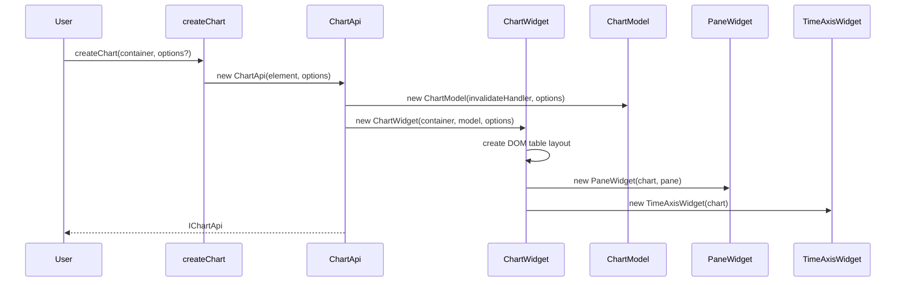
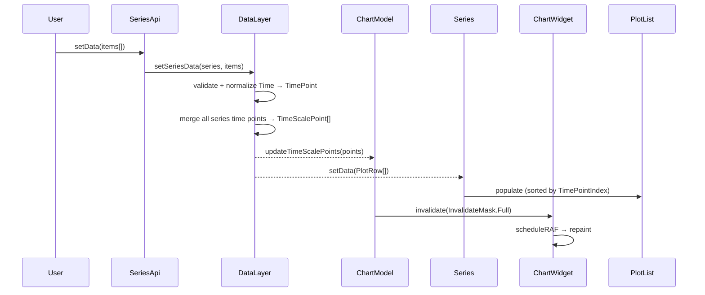
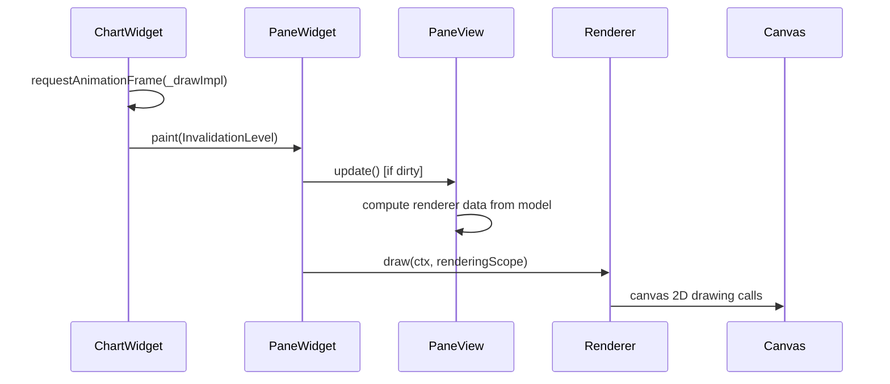

# Full Architecture Reference
**Project:** lightweight-charts v3.8.0-local
**Last updated:** 2026-03-24

---

## 1. System Overview

TradingView Lightweight Charts is a browser-only HTML5 canvas financial charting library. It renders interactive financial series (line, area, baseline, bar, candlestick, histogram) onto a `<canvas>` element. There are no server-side or SSR use cases — the library asserts browser environment at runtime.

**Single runtime dependency:** `fancy-canvas@0.2.2` — handles device pixel ratio scaling on canvas elements.

---

## 2. Layer Architecture

```
┌──────────────────────────────────────────┐
│  PUBLIC API   src/api/                   │
│  createChart() → IChartApi               │
│  ISeriesApi / ITimeScaleApi / IPriceScaleApi │
├──────────────────────────────────────────┤
│  GUI WIDGETS  src/gui/                   │
│  ChartWidget → PaneWidget(s)             │
│                TimeAxisWidget            │
│                PriceAxisWidget(s)        │
├──────────────────────────────────────────┤
│  MODEL        src/model/                 │
│  ChartModel → Pane(s) → Series           │
│               PriceScale / TimeScale     │
│               Crosshair / Watermark      │
├──────────────────────────────────────────┤
│  VIEWS        src/views/                 │
│  pane/ · price-axis/ · time-axis/        │
├──────────────────────────────────────────┤
│  RENDERERS    src/renderers/             │
│  Stateless canvas drawing primitives     │
└──────────────────────────────────────────┘
           src/formatters/   src/helpers/
           (shared, imported by layers above)
```

---

## 3. Object Ownership Tree

```
ChartApi (src/api/chart-api.ts)
├── ChartWidget (src/gui/chart-widget.ts)
│   ├── ChartModel (src/model/chart-model.ts)
│   │   ├── Pane[] (src/model/pane.ts)
│   │   │   └── Series[] (src/model/series.ts)
│   │   │       └── PlotList (src/model/plot-list.ts)
│   │   ├── PriceScale[] (src/model/price-scale.ts)
│   │   ├── TimeScale (src/model/time-scale.ts)
│   │   ├── Crosshair (src/model/crosshair.ts)
│   │   └── Watermark (src/model/watermark.ts)
│   ├── PaneWidget[] (src/gui/pane-widget.ts)
│   │   └── PriceAxisWidget (src/gui/price-axis-widget.ts)
│   └── TimeAxisWidget (src/gui/time-axis-widget.ts)
└── DataLayer (src/api/data-layer.ts)
```

---

## 4. Data Flows

### 4.1 Initial Chart Creation



### 4.2 Series Data Ingestion



### 4.3 Repaint Cycle



### 4.4 Coordinate Transform Chain

```
User price value (number)
  → PriceScale.priceToCoordinate(price, baseValue)
  → Coordinate (pixels from top of pane, nominal number)

User time / TimePointIndex
  → TimeScale.indexToCoordinate(index)
  → Coordinate (pixels from left of chart)
```

---

## 5. Series Type Map

| Series Type | API method | View | Renderer |
|---|---|---|---|
| Line | `addLineSeries()` | `SeriesLinePaneView` | `line-renderer.ts` |
| Area | `addAreaSeries()` | `SeriesAreaPaneView` | `area-renderer.ts` |
| Baseline | `addBaselineSeries()` | `SeriesBaselinePaneView` | `baseline-renderer.ts` |
| Bar | `addBarSeries()` | `SeriesBarsPaneView` | `bars-renderer.ts` |
| Candlestick | `addCandlestickSeries()` | `SeriesCandlesticksPaneView` | `candlesticks-renderer.ts` |
| Histogram | `addHistogramSeries()` | `SeriesHistogramPaneView` | `histogram-renderer.ts` |

Each series also creates companion views: `SeriesPriceLinePaneView`, `SeriesLastPriceAnimationPaneView`, `SeriesMarkersPaneView`, `SeriesPriceAxisView`.

---

## 6. Invalidation System

Model changes do not trigger immediate redraws. Changes are batched via `InvalidateMask`.

### Invalidation Levels (ascending severity)

| Level | Value | Triggers |
|---|---|---|
| `None` | 0 | No repaint needed |
| `Cursor` | 1 | Crosshair position only |
| `Light` | 2 | Axis labels, price labels |
| `Full` | 3 | Everything — series data, layout |

### Time Scale Invalidations

Separate from pane invalidation; queued on `InvalidateMask`:
- `FitContent` — fit all series data
- `ApplyRange` — set logical range
- `ApplyBarSpacing` — change bar spacing
- `ApplyRightOffset` — shift right offset
- `Reset` — restore defaults

Multiple invalidations accumulate (merge) between RAF frames. The highest level wins.

---

## 7. Event System

Events use `Delegate<T>` — a typed pub/sub with explicit `subscribe()` / `unsubscribe()` / `fire()`.

| Event | Source | Public API |
|---|---|---|
| `clicked` | `ChartWidget._clicked` | `IChartApi.subscribeClick()` |
| `crosshairMoved` | `ChartWidget._crosshairMoved` | `IChartApi.subscribeCrosshairMove()` |
| `customPriceLineDragged` | `ChartWidget._customPriceLineDragged` | `IChartApi.subscribeCustomPriceLineDragged()` |
| `visibleTimeRangeChanged` | `TimeScale` | `ITimeScaleApi.subscribeVisibleTimeRangeChange()` |
| `visibleLogicalRangeChanged` | `TimeScale` | `ITimeScaleApi.subscribeVisibleLogicalRangeChange()` |
| `sizeChanged` | `ChartWidget` | `IChartApi.subscribeSizeChanged()` |

---

## 8. Time Data Model

Two supported time formats at the public API boundary (`Time` union type):
- `UTCTimestamp` — Unix timestamp in **seconds** (not milliseconds)
- `BusinessDay` — `{ year, month, day }` object
- `string` — ISO 8601 date string (`"YYYY-MM-DD"`) — parsed to `BusinessDay`

Internally, all time is normalized to `TimePoint` (`{ timestamp: UTCTimestamp, businessDay?: BusinessDay }`) by `DataLayer`. `TimePointIndex` is the logical integer index into the shared time axis array.

---

## 9. Options Architecture

All public options are `DeepPartial<T>`. Merging strategy:

```
User options (DeepPartial)
  → merge() with defaults from src/api/options/*-defaults.ts
  → ChartOptionsInternal / SeriesOptionsInternal (fully resolved)
  → stored on model objects
```

`merge()` is a deep recursive merge (in `src/helpers/strict-type-checks.ts`). Arrays are replaced, not merged.

---

## 10. Build Pipeline

```
src/**.ts
  │
  ├─(tsc, tsconfig.prod.json)──► lib/prod/src/**.js + **.d.ts
  │
  ├─(rollup)─────────────────────► dist/lightweight-charts.esm.development.js
  │                                 dist/lightweight-charts.esm.production.js
  │                                 dist/lightweight-charts.standalone.development.js
  │                                 dist/lightweight-charts.standalone.production.js
  │
  └─(dts-bundle-generator)───────► dist/typings.d.ts
```

Production builds (`NODE_ENV=production`):
- Terser minification
- Property mangling: `_private_*` and `_internal_*` prefixes → short names
- `@internal` members stripped from typings

---

## 11. TypeScript Composite Project Structure

Composite projects enforce layer isolation at compile time. `tsc-verify` (`tsconfig.composite.json`) runs the full graph and catches invalid cross-layer imports and cyclic dependencies.

```
tsconfig.composite.json
├── src/tsconfig.composite.json
│   ├── src/api/tsconfig.composite.json
│   ├── src/gui/tsconfig.composite.json
│   ├── src/helpers/tsconfig.composite.json
│   └── src/formatters/tsconfig.composite.json
└── tests/unittests/tsconfig.composite.json
```

---

## 12. Key Design Patterns

| Pattern | Where used | Purpose |
|---|---|---|
| Nominal types | `Coordinate`, `TimePointIndex`, `UTCTimestamp`, `BarPrice` | Prevent mixing semantically different numbers |
| `DeepPartial<T>` | All public option types | Allow partial option objects from users |
| `Delegate<T>` | All internal events | Typed pub/sub without external deps |
| `IDestroyable` | `ChartWidget`, `PaneWidget`, `Series`, etc. | Explicit lifecycle / cleanup |
| Invalidation batching | `InvalidateMask` | Coalesce multiple model changes into one RAF repaint |
| View caching | `IUpdatablePaneView.update()` | Avoid recomputing renderer data on every frame |
| Stateless renderers | All `src/renderers/` | Renderers are pure functions over view data |
